<div align="center">


</div>

<br/>

<div align="center">


</div>

<br/>

<div align="center">


</div>

---

<div align="center">

</div>

---

## ⚡ RUNTIME STATUS MONITOR

<div align="center">

```diff
@@ BRIDGE AI OS — LIVE PROCESS TABLE @@

+ [CORE]    SUPER BRAIN        ████████████████████  ONLINE     ✓
+ [NET]     API GATEWAY        ████████████████████  ROUTING    ✓
+ [INT]     OSINT AGENT        ██████████████░░░░░░  SCANNING   ✓
+ [CRM]     CRM ENGINE         ████████████████████  SYNCING    ✓
+ [PAY]     BILLING SYSTEM     ████████████████████  LIVE       ✓
+ [AUTH]    ZERO-TRUST FABRIC  ████████████████████  SECURED    ✓
+ [VIS]     SVG SKILL ENGINE   ████████████████████  RENDERING  ✓
+ [CDN]     CLOUDFLARE EDGE    ████████████████████  26 DOMAINS ✓
+ [DB]      POSTGRES + REDIS   ████████████████████  PERSISTING ✓
+ [GRAPH]   NEO4J NETWORK      ████████████████████  CONNECTED  ✓
! [BUILD]   CI/CD PIPELINE     ░░░░░░░░░░░░░░░░░░░░  BUILDING...
```

</div>

---

## 🏗️ FIVE-TIER PRODUCTION ARCHITECTURE

<div align="center">

```
╔═══════════════════════════════════════════════════════════════════╗
║  TIER 0 ─ DNS / CDN                                               ║
║  ☁  CLOUDFLARE ANYCAST  ─  26 PRODUCTION DOMAINS  ─  DDoS SHIELD ║
╠══════════════════════════════╦════════════════════════════════════╣
║  TIER 1 ─ REVERSE PROXY      ║  🛡  NGINX TLS 1.3                 ║
║  Port 80 / 443               ║  UFW Firewall  ─  Rate Limiting    ║
╠══════════════════════════════╩════════════════════════════════════╣
║  TIER 2 ─ GATEWAY LAYER                                           ║
║  ⚡ gateway.js :8080  ─  SSE  ─  Auth Facade  ─  Load Balancer   ║
╠═══════════════╦═══════════════════╦═══════════════════════════════╣
║  TIER 3A      ║  TIER 3B          ║  TIER 3C                      ║
║  Node.js      ║  Python/FastAPI   ║  Visual Layer                 ║
║  :3000 core   ║  :8000 brain.py   ║  :7070 SVG Engine             ║
║  :3001 crm    ║  :8001 ban.py     ║  :3020 React SPA              ║
║  :3002 bill   ║  AI inference     ║  Skill Graph UI               ║
║  :4000 osint  ║  BAN engine       ║  Live dashboards              ║
║  :5002 auth   ║                   ║                               ║
╠═══════════════╩═══════════════════╩═══════════════════════════════╣
║  TIER 4 ─ PERSISTENCE                                             ║
║  PostgreSQL  ─  Redis  ─  Neo4j  ─  SQLite  ─  Supabase          ║
╚═══════════════════════════════════════════════════════════════════╝
```

</div>

---

## 🤖 AUTONOMOUS AGENT NETWORK

<div align="center">

</div>

<br/>

<div align="center">

<table>
<tr>
<td align="center" width="180">

🧠<br/>
**SUPER BRAIN**<br/>
`Central AI Twin`<br/>
`WebSocket Core`<br/>


</td>
<td align="center" width="180">

🕵️<br/>
**OSINT AGENT**<br/>
`Intel Gathering`<br/>
`Data Collection`<br/>


</td>
<td align="center" width="180">

📊<br/>
**CRM ENGINE**<br/>
`Lead Scoring`<br/>
`Pipeline Mgmt`<br/>


</td>
<td align="center" width="180">

💳<br/>
**BILLING AGENT**<br/>
`Revenue Engine`<br/>
`Subscriptions`<br/>


</td>
</tr>
<tr>
<td align="center" width="180">

🔐<br/>
**AUTH FABRIC**<br/>
`JWT + SIWE`<br/>
`Zero-Trust`<br/>


</td>
<td align="center" width="180">

🎨<br/>
**SVG ENGINE**<br/>
`Skill Graphs`<br/>
`Visual Composition`<br/>


</td>
<td align="center" width="180">

🌐<br/>
**API GATEWAY**<br/>
`Unified Proxy`<br/>
`Request Router`<br/>


</td>
<td align="center" width="180">

👁️<br/>
**GOD MODE**<br/>
`Topology View`<br/>
`Full Control`<br/>


</td>
</tr>
</table>

</div>

---

## ⚙️ TECH MATRIX

<div align="center">

**`── LANGUAGES & FRAMEWORKS ──`**


**`── DATABASES & STORAGE ──`**


**`── INFRASTRUCTURE & DEVOPS ──`**


**`── SECURITY & PROTOCOLS ──`**


<br/>


</div>

---

## 📊 PROFICIENCY MATRIX

<div align="center">

</div>

---

## 🌐 26-DOMAIN PRODUCTION NETWORK

<div align="center">

```
 ╔══════════════════════════════════════════════════════════════╗
 ║                 CLOUDFLARE EDGE MESH — LIVE                  ║
 ╠══════════════════════════════════════════════════════════════╣
 ║  🌐  bridge-ai-os.com          PRIMARY PLATFORM              ║
 ║  🏗️   abaas.bridge-ai-os.com   ABAAS CONTROL PLANE           ║
 ║  👁️   god.bridge-ai-os.com     GOD MODE TOPOLOGY DASHBOARD   ║
 ║  🧠  brain.bridge-ai-os.com    SUPER BRAIN AI ENDPOINT       ║
 ║  📡  live.bridge-ai-os.com     DIGITAL TWIN LIVE WALL        ║
 ║  🎨  svg.bridge-ai-os.com      SVG SKILL ENGINE UI           ║
 ║  ⚡  api.bridge-ai-os.com      GATEWAY ENTRYPOINT            ║
 ║  🔐  auth.bridge-ai-os.com     ZERO-TRUST AUTH FABRIC        ║
 ║  💳  billing.bridge-ai-os.com  REVENUE ENGINE                ║
 ║  📊  crm.bridge-ai-os.com      CRM INTELLIGENCE DASHBOARD    ║
 ║  🕵️   osint.bridge-ai-os.com   INTEL OPERATIONS CENTER       ║
 ║  🗄️   db.bridge-ai-os.com      DATA PERSISTENCE LAYER        ║
 ║  🔮  ░░░░░░░░░░░░░░░░░░░░░░░░  + 14 CLASSIFIED ENDPOINTS     ║
 ╚══════════════════════════════════════════════════════════════╝
```

</div>

---

## 🔑 CORE CAPABILITIES

<div align="center">

| Capability | Description | Status |
|:---:|:---|:---:|
| 🧠 **AI Orchestration** | Compose & deploy multi-agent AI pipelines at scale | `LIVE` |
| 🔗 **Tool Integration** | Plug any API, DB, or service as a first-class citizen | `LIVE` |
| ⚡ **Real-Time Engine** | WebSocket-powered dynamic workflow execution | `LIVE` |
| 🔐 **Zero-Trust Auth** | JWT + SIWE multi-layer Web3 security fabric | `LIVE` |
| 💳 **Revenue Engine** | Native billing, subscriptions & monetization layer | `LIVE` |
| 🌐 **CDN Infrastructure** | 26-domain Cloudflare production mesh | `LIVE` |
| 📊 **Visual Intelligence** | SVG Skill Graph rendering & composition engine | `LIVE` |
| 🤖 **Agent Swarm** | Modular, role-specific, composable autonomous agents | `LIVE` |
| 👁️ **GOD MODE** | Full topology dashboard & architect-level control | `LIVE` |
| 🕸️ **Graph Brain** | Neo4j-powered agent relationship intelligence | `LIVE` |

</div>

---

## 💀 TERMINAL — LIVE BOOT SEQUENCE

<div align="center">

</div>

---

## 📈 LIVE METRICS

<div align="center">


&nbsp;


</div>

<div align="center">


</div>

---

## 🏆 ACHIEVEMENT MATRIX

<div align="center">


</div>

---

## 🔮 WHAT IS BRIDGE AI OS?

<div align="center">


</div>

<br/>

```diff
@@                  BEFORE  vs  AFTER                     @@

- Fragmented AI tools         →  Unified agent swarm
- Manual workflows            →  Autonomous pipelines
- No billing layer            →  Native revenue engine
- Siloed data stores          →  Federated persistence tier
- Single domain               →  26-domain CDN mesh
- Trust-based auth            →  Zero-trust security fabric
- No visual intelligence      →  SVG Skill Graph engine
- One-off scripts             →  GOD MODE orchestration
```

---

## 🖥️ QUICKSTART

<div align="center">


</div>

---

<div align="center">


</div>

<div align="center">

```
 ╔═════════════════════════════════════════════════════════╗
 ║                                                         ║
 ║   ⚡ Engineered for domination. Designed for infinity.  ║
 ║                                                         ║
 ║         BUILD  ·  BRIDGE  ·  DEPLOY  ·  REPEAT          ║
 ║                                                         ║
 ╚═════════════════════════════════════════════════════════╝
```

<br/>


<br/>


</div>
